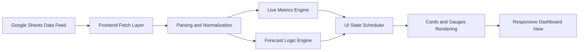
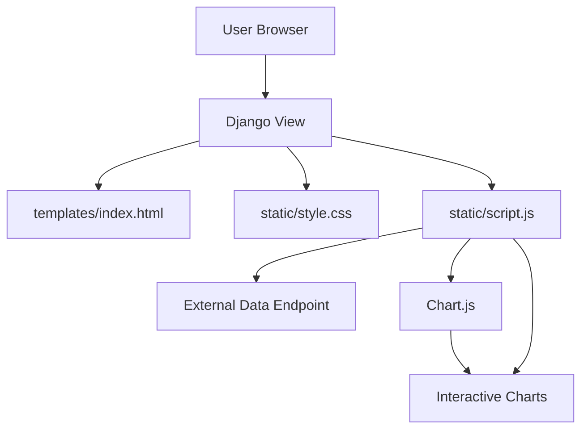

<div align="center">

# Weather Prediction Dashboard

A professional, responsive weather intelligence dashboard built with Django, featuring live metrics, short-term forecasting, and mobile-first performance optimization.


</div>

---

## Overview

Weather Prediction Dashboard is a full-stack Django web application for monitoring local weather conditions and presenting short-term forecasts in a modern UI.

The system combines:
- Live environmental indicators (temperature, humidity, AQI, day/night, rain).
- Forecast cards for rain chance, temperature trend, humidity trend, and wind speed.
- Optimized rendering behavior for smoother mobile experience.

---

## Visual Flow

### End-to-End Data Flow



### Runtime Architecture



---

## Feature Set

| Module | Capabilities |
|---|---|
| Live Data | Temperature, Humidity, AQI, Day/Night, Rain Status |
| Forecasting | Rain Chance, Temperature Prediction, Humidity Prediction, Wind Speed |
| UI/UX | Sidebar navigation, tab switch, adaptive cards, neutral dark professional theme |
| Performance | Mobile-lite mode, reduced visual overhead, hidden-tab update control, lazy assets |
| Feedback | Integrated feedback form and contact panel |

---

## Technology Stack

| Layer | Technologies |
|---|---|
| Backend | Python, Django |
| Frontend | HTML5, CSS3, JavaScript |
| Visualization | Chart.js |
| Data Source | Google Sheets JSON feed |
| Deployment-ready server | Django WSGI/ASGI |

---

## Project Structure

```text
local_weather_prediction/
|-- app.py
|-- manage.py
|-- requirements.txt
|-- README.md
|-- weather_dashboard/
|-- weather_app/
|-- templates/
|   `-- index.html
|-- static/
|   |-- style.css
|   |-- script.js
|   `-- image/
`-- image/
```

---

## Quick Start

### 1. Create virtual environment

```powershell
python -m venv .venv
.\.venv\Scripts\Activate.ps1
```

### 2. Install dependencies

```powershell
pip install -r requirements.txt
```

### 3. Run the app

```powershell
python manage.py runserver
```

Open in browser:

- http://localhost:8000

---

## Configuration

Environment variables supported by the Django launcher:

| Variable | Default | Purpose |
|---|---|---|
| DJANGO_HOST | 0.0.0.0 | Host binding for app.py launcher |
| DJANGO_PORT | 8000 | Port for app.py launcher |
| DJANGO_DEBUG | 1 | Controls Django debug mode |
| DJANGO_ALLOWED_HOSTS | * | Comma-separated allowed hosts |
| DJANGO_SECRET_KEY | django-insecure-weather-prediction-change-me | Secret key override |

## Production Notes

- This project now runs on Django.
- Use `gunicorn weather_dashboard.wsgi:application --bind 0.0.0.0:$PORT` for Linux-based deployments.
- `gunicorn` is listed in `requirements.txt` and must be installed before deploy.
- If your platform supports a Procfile, it will use the included startup command automatically.

---

## Performance Engineering Notes

- Adaptive runtime mode for mobile and constrained devices.
- Reduced animation overhead for smoother scrolling.
- Asynchronous Chart.js loading.
- Lazy image loading for non-critical assets.
- Render scheduling to prevent excessive DOM updates.
- Reduced or disabled expensive effects where appropriate.

---

## Team

- Arpan Das - IoT Device Development
- Surajit Sutradhar - Backend and AI Model
- Arijit Kumar Sarkar - Frontend and Data Handling
- Arindam Roy - Research and Testing
- Jeet Bera - Research and Testing

---

## License

This project is currently intended for academic/final-year use.

If you plan public distribution, add a formal license file (for example, MIT).
